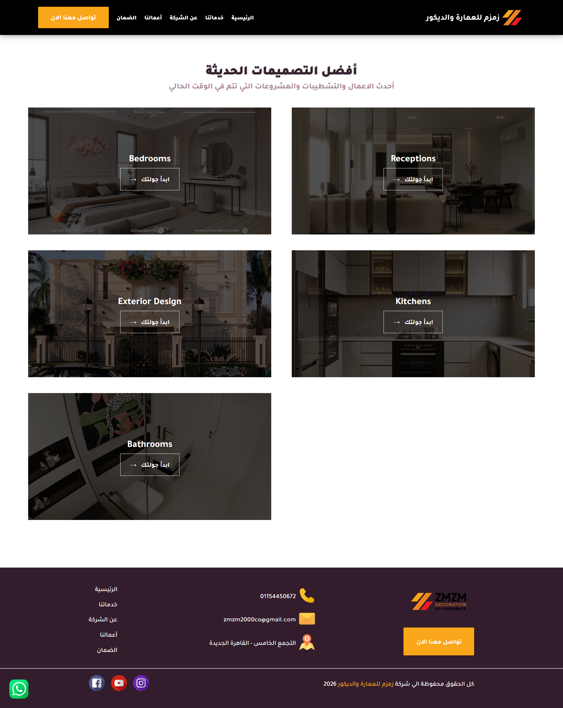
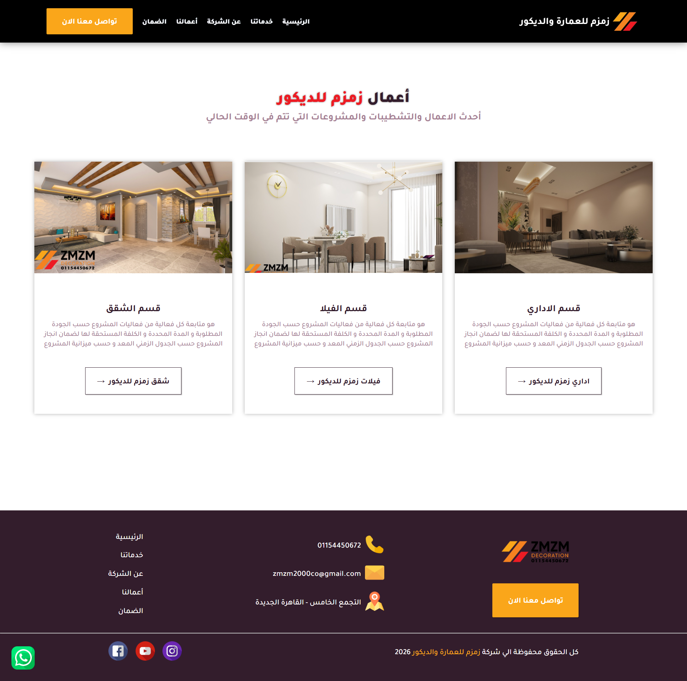

<div align="center">

<br/>

[](https://laravel.com)
[](https://php.net)
[](https://mysql.com)
[](https://getbootstrap.com)
[](https://vitejs.dev)
[](#)
[](#)

<br/>

> *"Where elegance meets innovation — crafting spaces that inspire."*

<br/>

</div>

---

## 📖 About ZMZM Decor

**ZMZM Decor** is a full-stack web application built for a premium interior design and decoration company. It serves as a sophisticated digital platform showcasing curated design categories, luxurious villa projects, and professional services — empowering clients to explore, connect, and experience world-class decor solutions.

The platform features a comprehensive **Admin Dashboard** for full content control and a seamless browsing experience across all devices.

---

## ✨ Key Features

<table>
<tr>
<td width="50%">

### 🏠 Frontend
- 🎨 **Home Page** — Elegant hero section with featured highlights
- 🛋️ **Services** — Detailed interior design service offerings
- 🏛️ **Project Services** — Service breakdown per project type
- 🏰 **Villas** — Luxury villa project showcases
- 📁 **Categories** — Browse designs by style and category
- 🖼️ **Project Gallery** — Full decor project portfolio with rich media

</td>
<td width="50%">

### ⚙️ Platform
- 🔐 **Admin Dashboard** — Full CMS for all website content
- 📱 **Fully Responsive** — Optimized for mobile, tablet & desktop
- 📞 **Client Inquiry** — Contact forms & call request booking
- 🔗 **Social Integration** — WhatsApp & social media quick access

</td>
</tr>
</table>

---


## 📸 Screenshots
 
<details>
<summary>🏠 <strong>Home Page</strong></summary>
<br/>
 

 
</details>
 
<details>
<summary>🛋️ <strong>Services</strong></summary>
<br/>
 

 
</details>
 
<details>
<summary>🔧 <strong>Project Services</strong></summary>
<br/>
 

 
</details>
 
<details>
<summary>🏰 <strong>Villas</strong></summary>
<br/>
 

 
</details>
 
<details>
<summary>📁 <strong>Categories</strong></summary>
<br/>
 

 
</details>
 
<details>
<summary>🖼️ <strong>Project Details</strong></summary>
<br/>
 

 
</details>
 
---

## 🛠️ Tech Stack

| Layer | Technology | Purpose |
|:------|:-----------|:--------|
| **Backend** |  Laravel 9.19 | Core framework & routing |
| **Language** |  PHP 8.0.2+ | Server-side logic |
| **Templating** |  Blade | Server-side views |
| **Database** |  MySQL | Relational data storage |
| **Styling** |  SCSS / Sass | Custom theming & styles |
| **CSS Framework** |  Bootstrap 5 | Responsive UI components |
| **Build Tool** |  Vite | Fast frontend bundling |
| **JavaScript** |  Vanilla JS | Interactive behaviors |
| **i18n** |  Laravel Localization | Arabic & English support |

---

## 📄 Key Pages & Routes

| Page | Route | Description |
|:-----|:-------|:-----------|
| 🏠 Home | `/` | Hero section, highlights & featured content |
| 🛋️ Services | `/services` | Full interior design service catalog |
| 🔧 Project Services | `/project-services` | Per-project service breakdown |
| 🏰 Villas | `/villas` | Luxury villa projects showcase |
| 📁 Categories | `/categories` | Design styles and collection browsing |
| 🖼️ Project Details | `/projects/{slug}` | Individual project gallery & details |
| 📞 Contact | `/contact` | Inquiry form, locations & call booking |

---

## 🔐 Admin Dashboard

A fully-featured **Admin Panel** enables complete content management without touching any code.

| Section | What You Can Manage |
|:--------|:-------------------|
| 🏠 **Home** | Hero content, background media, featured sections (AR & EN) |
| 🛋️ **Services** | Add / edit / delete service offerings with descriptions |
| 🔧 **Project Services** | Manage services linked to specific project types |
| 🏰 **Villas** | Create and update luxury villa project entries |
| 📁 **Categories** | Design style categories with images & descriptions |
| 🖼️ **Projects** | Full project CRUD with gallery images & details |
| 🔗 **Social Links** | Manage all social media & external links |

> ✅ All content is fully editable in **both Arabic and English** from the dashboard.

---

---

## 📁 Project Structure

```
zmzm-decor/
├── app/
│   ├── Http/
│   │   ├── Controllers/        # Page & API controllers
│   │   └── Middleware/         # Auth, locale, etc.
│   └── Models/                 # Eloquent ORM models
├── database/
│   ├── migrations/             # Database schema
│   └── seeders/                # Sample/demo data
├── lang/
│   ├── en/                     # English translations
│   └── ar/                     # Arabic translations
├── resources/
│   ├── views/                  # Blade templates
│   ├── js/                     # JavaScript files
│   └── scss/                   # SCSS stylesheets & themes
├── routes/
│   └── web.php                 # Application routes
├── public/                     # Public assets
└── vite.config.js              # Frontend build config
```

---

## 👤 Developer

<div align="center">

**Muhammed Ashraf Saleh**

[](https://github.com/MuhammedAshrafSaleh)

</div>

---

## 📄 License

This project is proprietary software developed for **ZMZM Decor**. All rights reserved © 2024.

---

<div align="center">


*Built with ❤️ using Laravel & Bootstrap*

</div>
